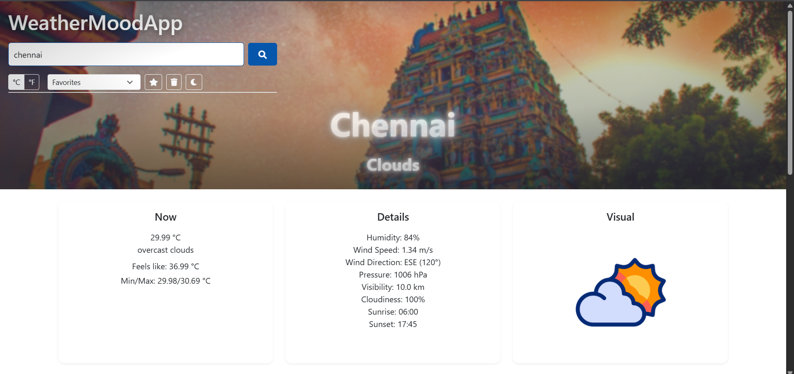

# WeatherMoodApp
To check the weather and display a current location weather.

[](https://heyshreee.github.io/WeatherMoodApp/)


## 🌦️ Live Demo
Check out the live app here 👉 [WeatherMoodApp](https://heyshreee.github.io/WeatherMoodApp/)


# 🌦️ WeatherMoodApp

WeatherMoodApp is a responsive weather application that shows **real-time weather details** based on user search or current location.  
It also displays a **mood image of the city** using the Unsplash API and a **weather animation (GIF)** for a more engaging experience.

---

## 🚀 Features

- 🌍 Get weather using **current location** (Geolocation API).
- 🔍 Search weather by **city name**.
- 🌆 Display **city background images** (Unsplash API).
- 🌤️ Dynamic **weather animations** (GIFs for Sunny, Clouds, Rain, etc.).
- 📊 Show temperature, description, humidity, and wind speed.
- 📱 Fully **responsive UI** with smooth animations.

---

## 🛠️ Tech Stack

- **HTML5**  
- **CSS3** (Responsive + Glow effects + Animations)  
- **JavaScript (ES6)**  
- **OpenWeatherMap API** (Weather data)  
- **Unsplash API** (City images)  

---

## ⚙️ Setup & Installation

1. Clone the repository:
```bash
   git clone https://github.com/heyshreeee/WeatherMoodApp.git
```

const API_KEY = "YOUR_OPENWEATHER_API_KEY";
const UNSPLASH_ACCESS_KEY = "YOUR_UNSPLASH_ACCESS_KEY";

